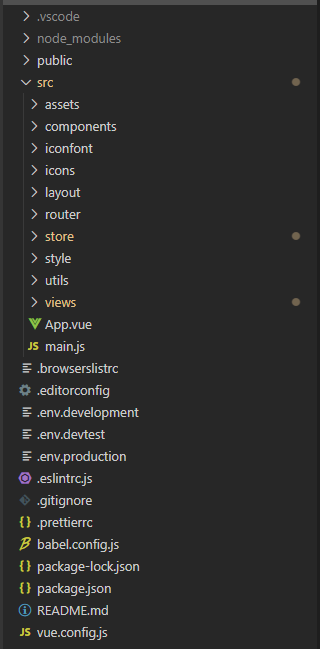
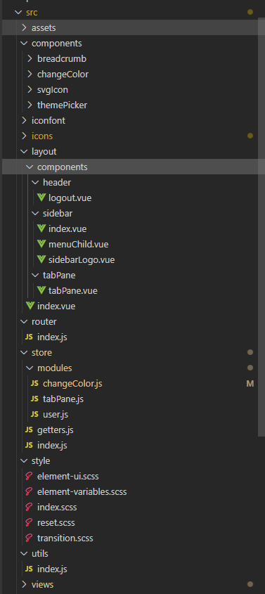
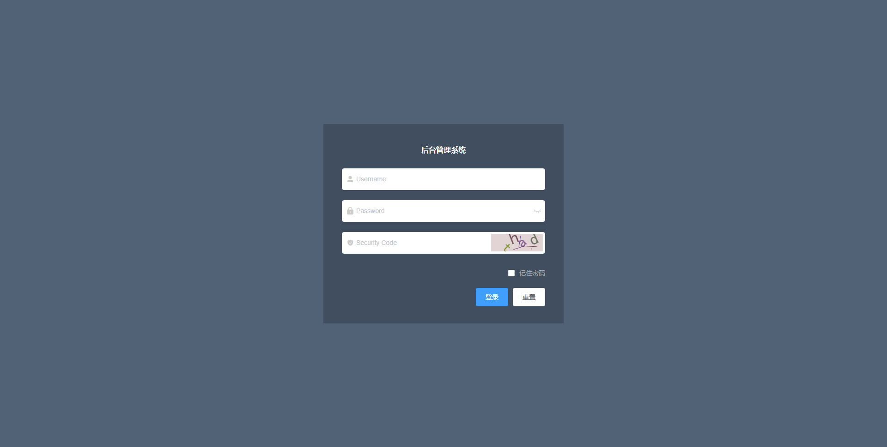
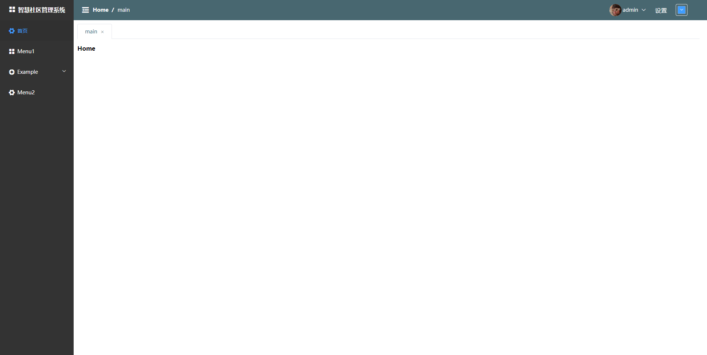
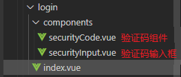
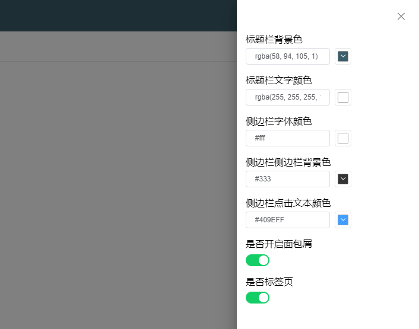

<!--
 * @Description: pc后台管理端
 * @Author: 武明琴
 * @Date: 2021-01-20 10:59:53
 * @EditAuthor: 修改人名称
 * @LastEditTime: 2021-02-19 17:41:48
-->

# pc 后台管理端

## 后台管理模板一

### 简介

此模板为基于 Vue 开发的极简的后台管理系统基本框架，采用 vue-cli4.x 版本以后的脚手架，它包含了 Element-UI,Svg,iconfont,Vuex 等后台必备的东西。研发初衷为了节省开发人员的搭建框架的时间，提升工作效率，提高框架的规范性，一致性。

[模板下载地址](https://git.tftnet.com/technology_platform_front/manage_system_templete_basis/-/tree/dev)

### 文件结构



::: tip 提示
主要文件注解参考[前端代码规范第一版](../standard/codeOne.md)
:::

### 公共方法及组件注解



1. components(存放项目公共组件)
   - breadcrumb (面包屑组件)
   - changeColor (修改颜色组件)
   - svgIcon (svg 组件)
   - themePicker (修改 Element-Ui 主题色组件)
2. layout(项目布局文件)
   - header(存放标题栏组件文件夹)
     - logout.vue (退出登录组件)
   - sidebar(存放侧边栏组件文件夹)
     - index(引入文件)
     - menuChild.vue(子菜单组件)
     - sidebarLogo.vue(标题和 logo)
   - tabPane(标签页组件)
3. store(vuex 状态管理)
   - modules(存放对应组件状态函数)
     - changeColor.js(颜色状态)
     - tabpane(标签页状态)
     - user(用户状态)
   - getters.js(获取状态函数)
   * index(vuex 主文件)
4. style(公共样式文件)
   - element-ui.scss(存放修改的 element 样式)
   - element-variables.scss(elemenet 主题样式)
   - idnex.scss(主文件)
   - reset.scss(修改默认样式)
   - transition.scss(过度效果样式)
5. utils(存放公共方法文件)

### 代码解释

1. router(局部):

```js
// 主路由必须放在routes第1位
{
    path: '/',
    name: 'layout',
    component: () => import('../layout'),
    redirect: '/home',
    children: [
      {
        path: 'home',
        name: 'Home',
        component: () => import('../views/home'),
        // title:为tab标签的名字，path为指定侧边栏导航路径，
        // hidden为控制是否在tab标签页和菜单中显示
        meta: {
          title: 'main',
          path: 'home'
        }
      },
      {
        path: 'Menu1',
        name: 'Menu1',
        component: () => import('../views/Menu1'),
        meta: {
          title: 'Menu1',
          path: 'Menu1',
          hidden:true
        }
      },
}
```

:::danger 重要
项目布局路由必须放在 routes 第 1 位
:::

### 页面预览

1. 登录页

   

2. 主页

   

### 功能介绍与修改方法

#### 登录功能

1. 登录文件格式  
   

2. 记住密码：  
   登陆时点击记住密码会在本地保存用户信息并设置过期时间，下次登录时如没过期则会自动填充账号密码，默认过期时间为 7 天。如需修改时间则在 index.vue 中 submitForm 函数中修改。

3. 登录状态 isLogin：  
    登录状态使用 vuex 结合本地存储实现，登陆成功后会在 localStorage 中保存登录状态，登录过期时间等。默认过期时间为两小时。如需修改时间则在文件 utils/index verification 中函数修改。

   ::: tip 验证码:
   如果不需要前端验证码则在 index.vue 中关闭或删除组件即可。
   :::

#### 主页功能

::: tip 提示:
前面已介绍过主页的文件格式(项目布局文件)
:::

1. Element-UI 主题切换:
   标题栏最右侧颜色切换器可切换 Element-UI 主题色，通过 Vuex 结合本地存储实现，每次切换会在 localStorage 中保存$--color-primary 字段，默认颜色为 Element-UI 默认主题色。如需永久保留主题，则将设置好的主题颜色复制到文件style/element-variables.scss中的$--color-primary 字段即可。
2. 面包屑：  
   面包屑在 router 中获取信息和路由，在 router 文件中为每个路由添加 meta 对象。例如：

3. 设置:
   点击标题栏中的设置，如图所示：
   
