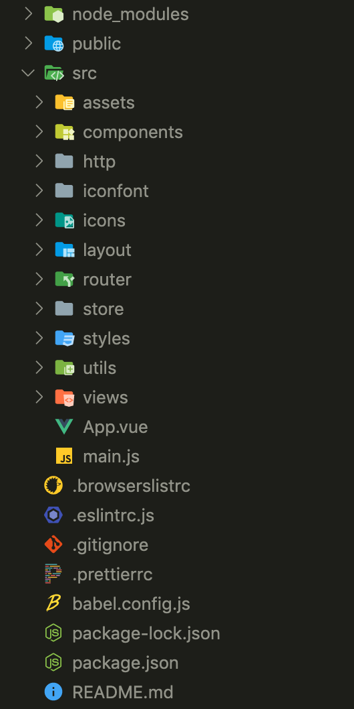

<!--
 * @Description: 前端代码规范第一版
 * @Author: 武明琴
 * @Date: 2021-01-20 10:46:37
 * @EditAuthor: 修改人名称
 * @LastEditTime: 2021-01-20 15:26:37
-->
# 前端代码规范第一版

## 项目命名规则

1. 本地项目文件夹命名为:`tuofu_project_gitLab`
2. 每个具体项目文件夹命名与gitLab库上项目命名统一,格式为: 
   - 项目名`_front_web` (pc端展示类项目,例如官网等)
   - 项目名`_front_h5` (移动端H5类项目,例如移动端项目,微信小程序,钉钉小程序,公众号等)
   - 项目名`_front` (pc端管理后台类项目,例如智慧社区管理后台等)
   ::: warning 注意
    名称过长采用首字母简写,分类过多每个分类间用下划线链接,   
    例如：bsq_smart_community_front，保税区智慧社区管理后台
   :::

## 项目内文件夹

::: tip 说明
 技术栈采用vue-cli4.x版本以后脚手架,如本地为4.x版本前的脚手架,请自行升级
:::
### 目录结构(基础)

### 注解
 1. node_modules (依赖包)
 2. public (最终打包入口文件包,静态包,打包时不会进行压缩操作)
    - favicon.ico (入口页面)
    - index.html (存放项目公共组件)
 3. src (具体业务包)
    - assets (存放静态资源，如css，js，图片,会被wabpack构建)
    - components (存放项目公共组件)
    - http (存放接口文件,文件名与模块名一致)
    - iconfont (存放字体图标库)
    - icons (存放svg图片库)
    - layout (存放项目布局文件,例如:header,silder,main)
    - router (路由文件)
    - store (vuex的状态管理)
    - styles (样式文件)
    - utils (环境地址配置)
    - views (项目页面目录)
    - App.vue (根组件)
    - main.js (入口js文件)
 4. tests (单元测试)
 5. browserslistrc (实现CSS3/ES678 语法兼容)
 6. eslintrc.js (#eslint的配置文件)
 7. gitignore (代码管理工具,做git配置的)
 8. prettierrc (代码风格配置文件)
 9. babel.config.js (babel语法编译文件)
 10. package-lock.json (锁定安装时的包的版本号，并且需要上传到git，以保证其他人在npm install时大家的依赖能保证一致)
 11. package.json (基于node的项目包配置文件(工具,命令..)(也是cnpm install配置的依据))
 12. README.md (项目说明书)

## 前端代码规范
[范详细见](https://zhuanlan.zhihu.com/p/250735334) 

### 命名规范
1. 基础规范：   
  全部采用小写驼峰命名 lowerCamelCase，或以中划线分隔，严禁使用拼音与英文混合的方式。名称总是使用可以反应目的和用途的名称，或其他通用的名称，代替表象和晦涩难懂的名称。
2. method方法命名：   
  必须是 动词 或者 动词+名词 形式。
   例如：saveShopCarData /openShopCarInfoDialog
    ::: danger 特此说明
      增删查改，详情统一使用如下 5 个单词，不得使用其他
      add / update / delete / detail / get
    :::
3. css命名：
     - 全局公用样式使用G-前缀(Global)，并遵循【前缀-大类-小类】或【前缀-描述】的写法。   
  例如：.G-btn-a // 按钮a   
  .G-icon-link // 图标link   
  .G-fl // float:left   
  .G-fr // float:right   
4. 常量命名全部大写，单词间用下划线隔开：例如：MAX_STOCK_COUNT

### 编写规范
1. 注释：
   - html分块注释，在每段完成某个功能性的html代码头部进行注释。
   - js函数注释，每个函数方法/变量/自定义字典项都要求注释，以提高可读性。
   - css要描述清楚目的和作用范围
   - 特殊引用以及特殊写法，要求写明用途和作用范围。
2. 语法：   
		优先使用 ES6,7 中新增的语法糖和函数。
3. 逻辑判断：
   - if, else, for, while, do, switch, try, catch, finally, with后必须有大括号。（即使代码块的内容只有一行）
   - 不要直接使用 undefined 进行变量判断；使用 typeof 和字串’undefined’对变量进行判断。   
		例如：if (typeof person === 'undefined') { ... }
   - 尽量使用三目运算符和逻辑运算符解决条件判断。
     ::: danger 谨记
      超过 3 层请抽成函数，并写清楚注释。
     :::
4. 编写尽量保持代码整洁，及时清理注释过的代码/console.log/断点。
5. css样式 ：
   - 如果你不写很通用的，需要匹配到 DOM 末端的选择器，你应该总是考虑直接子选择器。(可能会导致疼痛的设计问题并且有时候可能会很耗性能)
不推荐:                                 推荐:
.content .title {                           .content > .title {
  font-size: 2rem;                          font-size: 2rem;
}                                        }
   - 尽量使用缩写属性
   - 省略0后面的单位
   - 书写顺序：
	 + 位置属性(position, top, right, z-index, display, float等)
     + 大小(width, height, padding, margin)
     + 文字系列(font, line-height, letter-spacing, color- text-align等)
     + 背景(background, border等)
     + 其他(animation, transition等)
     + 尽量不用id选择器做css样式编写，尽量少用属性选择器和行内样式。
     + 层级(z-index)必须清晰明确：
  页面弹窗、气泡为最高级（最高级为999），不同弹窗气泡之间可在三位数之间调整；普通区块为10-90内10的倍数；区块展开、弹出为当前父层级上个位增加，禁止层级间盲目攀比。
     + 为选择器添加状态前缀：例如：.is-”前缀
     + 为每个页面样式设置单独作用域scoped。
6. vue页面：
	- 方法声明顺序：   
		components 模板   
  filter   
  props 父子组件传递信息   
  data   
  computed   
  watch   
  beforeCreate   
  created   
  beforeMount   
  mounted   
  beforeUpdate   
  update   
  activited   
  deactivated   
  beforeDestroy   
  destroyed   
  beforeRouteUpdate   
  methods   
   - vue书写风格：[Vue官方规范](https://cn.vuejs.org/v2/style-guide/)中的A规范为基础，在其上面进行项目开发，故所有代码均遵守该规范。

### 常用命名中英文样例

中文|对应英文|中文|对应英文|中文|对应英文
:---:|:---:|:---:|:---:|:---:|:---:
滚动|scroll|头|header|友情链接|friendlink
搜索|search|尾|footer|版权|copyright
下载|download|导航|nav|登录条|loginbar
上传|upload|侧栏|sidebar|布局|layout
加入|joinus|左导航|leftsidebar|提示信息|msg
服务|service|栏目|column|标签|tags
注册|regsiter|内容|content|标志|logo
投票|vote|内容|container|小技巧|tips
状态|status|页面外围|wrapper|广告|banner
登陆|login|左右中|left right center|栏目标题|title
图标|icon|列表|list|热点|hot
按钮|btn|页面主体|main|指南|guide
标签页|tab|子导航|subnav|新闻|news
图片|pic|菜单|menu|合作伙伴|partner
课程|course|子菜单|submenu|当前的|current
一节课|lesson|摘要|summary|暂时的|temp
文件(资源)|file|部分/小节|section|统计|statistics
文档|doc|旁边|aside|计数|count
移去|remove|元素项|item|确认|confirm
添加|add(create)|搜索框|searchbox|取消|cancel
导入|import|返回|back|提交|submit
导出|export|可用、启用|enabled|保存|save
更新|update|禁用|disabled|清空|clear
编辑|edit/modify|选中(下拉)|selected|发送|send
转换|transform|选中(选择）|checked|男/女性|male/femele
变更|change|背景|bg|合法的|validated
切换|toggle|容器|wrap|全局的|global
