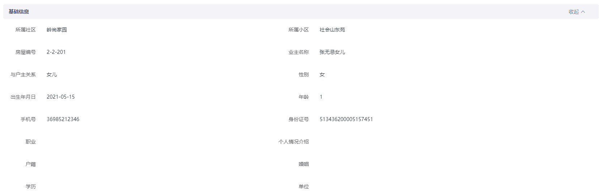

# collapse

## 介绍



- **collapse 是一个适用于 pc 端的展开收缩的组件 ，一般用于新增、修改、详情页，展示内容过多，需要折叠展示。**

## 样式

<collapse-demo></collapse-demo>

## 使用说明

将组件放入 src\components 的组件文件夹内，在需要使用的页面进行如下引入：

```js
import collapseItem from '@/components/collapse';
export default { 
  components: {
    collapseItem, 
  }, 
};
```

_在 vue 页面 template 中写入以下代码段_

```html
<collapse-item :is-collapse="true" handleColor="#666666">
  <span slot="title" class="collapse-title-16"> 基础信息</span>
  <div slot="collapse-main">
    <div>这是折叠主体</div>
  </div>
</collapse-item>
```

名称为 title 的 solt 插槽是展示头部基础信息的，名称为 collapse-main 的插槽是展示折叠部分主体的，可以通过设置下面参数配置的说明来控制组件中的样式及功能，其中所有参数都是非必填，大部分参数都有
默认值，无默认值的参数都是设置样式的，不传参就使用元素本身的样式。

## 组件代码

<<< @/docs/.vuepress/components/collapse.vue


## 传参配置

1、isCollapse

- isCollapse 参数用来控制是否使用收缩功能，默认 true 为存在展开收缩功能,false 为没有此功能。

| 名称       |  类型   |  必填 | 默认值 |
| ---------- | :-----: | ----: | :-----: |
| isCollapse | Boolean | false |   true |

2、isTitle

- isTitle 参数用来控制是否显示头部标题，默认 true 为存在标题,false 为不展示标题。

| 名称    |  类型   |  必填 | 默认值 |
| ------- | :-----: | ----: | :-----: |
| isTitle | Boolean | false | true |

3、backgroundColor

- backgroundColor 参数用来控制头部背景颜色，默认为本身颜色。

| 名称            |  类型  |  必填 | 默认值 |
| --------------- | :----: | ----: | :-----: |
| backgroundColor | String | false | 无 |

4、titleColor

- titleColor 参数用来控制头部标题的颜色，默认为本身颜色。

| 名称       |  类型  |  必填 | 默认值 |
| ---------- | :----: | ----: | :-----: |
| titleColor | String | false | 无 |

5、handleColor

- handleColor 参数用来控制收缩的字体颜色，默认为本身颜色。

| 名称        |  类型  |  必填 | 默认值 |
| ----------- | :----: | ----: | :-----: |
| handleColor | String | false | 无 |

6、isToggleText

- isToggleText 参数用来控制是否需要展开收缩文字，true 为显示收缩,false 为不展示。

| 名称         |  类型   |  必填 | 默认值 |
| ------------ | :-----: | ----: | :-----: |
| isToggleText | Boolean | false | true |

7、isToggleIcon

- isToggleIcon 参数用来控制是否需要展开收缩图标，true 为显示收缩的下拉箭头,false 为不展示。

| 名称         |  类型   |  必填 | 默认值 |
| ------------ | :-----: | ----: | :-----: |
| isToggleIcon | Boolean | false | true |

8、openText

- openText 参数用来控制展开部分的文字，默认为展开。

| 名称     |  类型  |  必填 | 默认值 |
| -------- | :----: | ----: | :-----: |
| openText | String | false | 展开 |

9、closeText

- closeText 参数用来控制收起部分的文字，默认为收起。

| 名称      |  类型  |  必填 | 默认值 |
| --------- | :----: | ----: | :-----: |
| closeText | String | false | 收起 |

##小技巧

- 组件中默认是展示显示的，可以通过修改组件中的 data 中的 isToggle 来显示默认展开或收缩。

```js
data() { 
  return { isToggle: true }; 
}
```
